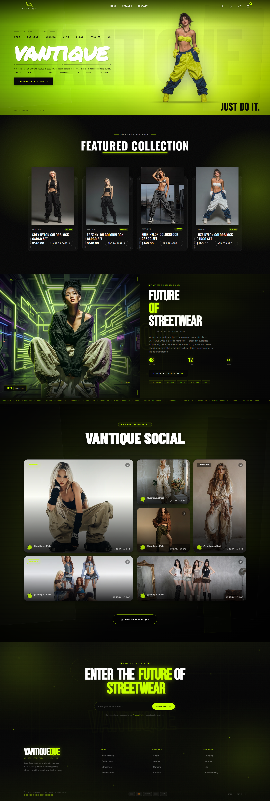
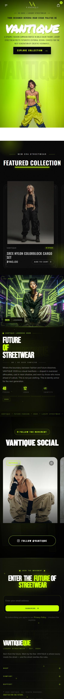

# 🚀 VANTIQUE – Future of Streetwear



A bold and futuristic streetwear eCommerce experience built with Shopify, combining modern fashion aesthetics, immersive animations, and a premium user experience.

---

## ✨ Overview

VANTIQUE is a high-end fashion storefront designed to showcase streetwear collections with a strong visual identity. The design focuses on clean layouts, smooth interactions, and a futuristic neon-inspired aesthetic that creates a memorable shopping experience.

### Key Highlights

- 🎨 Premium futuristic UI/UX
- ⚡ Smooth animations and transitions
- 📱 Fully responsive design
- 🛍️ Collection-focused shopping experience
- 🔥 Dynamic featured products section
- 📸 Social media showcase integration
- 💌 Newsletter subscription section
- 🌙 Dark mode inspired visual identity
- 🚀 Optimized for performance
- 🛒 Shopify eCommerce ready

---

## 🖼️ Homepage Preview

### Hero Section

Showcasing the latest streetwear collection with a bold visual presentation and strong call-to-action.

### Featured Collection

Premium product cards designed to maximize product visibility and conversions.

### Brand Story

A dedicated section introducing the future-focused vision behind the VANTIQUE brand.

### Social Gallery

Integrated social content layout to increase engagement and community trust.

### Newsletter Section

Designed to grow the customer base through email subscriptions.

---

## 🛠️ Built With

- Shopify
- Liquid
- HTML5
- CSS3
- JavaScript
- Responsive Design
- Custom Animations

---

## 📱 Responsive Design

The website is optimized for:

- Desktop
- Laptop
- Tablet
- Mobile Devices

---

## 🎯 Features

### Modern Navigation

- Clean header layout
- Interactive icons
- Smooth scrolling experience

### Product Experience

- Product showcase cards
- Hover effects
- Quick add-to-cart functionality

### Visual Effects

- Neon-inspired highlights
- Glow effects
- Smooth hover animations
- Modern typography

### Performance

- Optimized assets
- Fast loading experience
- Mobile-first considerations

---

## 📂 Project Structure

```bash
.
├── assets/
├── sections/
├── snippets/
├── templates/
├── layout/
├── config/
└── locales/
```

---

## 🚀 Installation

Clone the repository:

```bash
git clone https://github.com/ArnavAsif/Vantique.git
```

Navigate to the project:

```bash
cd vantique
```

Start development using Shopify CLI:

```bash
shopify theme dev
```

---

## 🎨 Design Inspiration

The design blends:

- Modern Streetwear
- Luxury Fashion
- Futuristic Aesthetics
- Editorial Style Layouts
- High-End eCommerce Experiences

---

## 📸 Screenshots



---

## 👨‍💻 Developed By

**Arnav Asif**

Shopify Developer & UI/UX Enthusiast

---

## ⭐ Support

If you like this project, consider giving it a star on GitHub.

---

### Future Never Follows. It Leads.